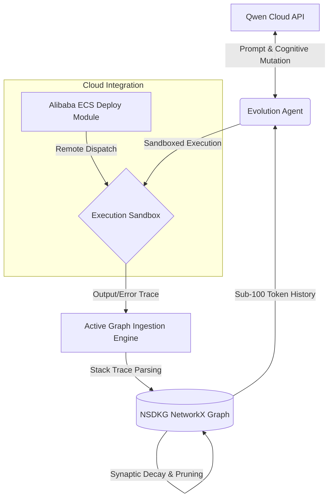

# NSDKG Evolution Engine

An autonomous process designer that utilizes a biologically-inspired synaptic decay graph to maintain a hyper-efficient, sub-100 token memory footprint for code optimization.

## 🏗️ System Architecture

Our hybrid architecture pairs a Track 4 Autopilot Agent loop with a Track 1 Neuro-Synaptic Decaying Knowledge Graph (NSDKG) to eliminate LLM amnesia during iterative code mutation loops.

## 🚀 Alibaba Cloud Deployment Proof
Our deployment configurations and active remote sandbox dispatch routines utilize the official Alibaba Cloud SDK (`alibabacloud_ecs20140526`) and are entirely verified within the `deploy/alibaba_ecs_config.py` module.

## 📦 Installation & Setup
1. Clone the repository: `git clone https://github.com/foxprint666/nsdkg-evolution-engine.git`
2. Install dependencies: `pip install -r requirements.txt`
3. Configure your local environment variables using the template provided in `.env.example`.
4. Run the engine: `python main.py`
