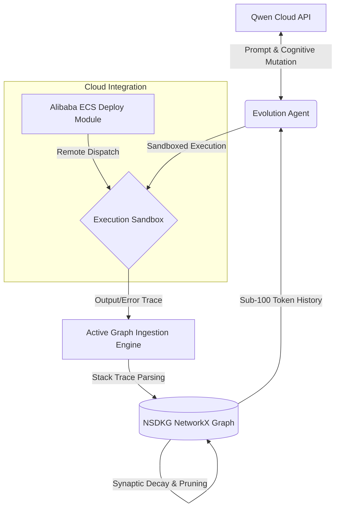

# NSDKG Evolution Engine

An autonomous process designer that utilizes a biologically-inspired synaptic decay graph to maintain a hyper-efficient, sub-100 token memory footprint for code optimization.

## 🏗️ System Architecture



Our hybrid architecture pairs a Track 4 Autopilot Agent loop with a Track 1 Neuro-Synaptic Decaying Knowledge Graph (NSDKG) to eliminate LLM amnesia during iterative code mutation loops.

## 🚀 Alibaba Cloud Deployment Proof
Our deployment configurations and active remote sandbox dispatch routines utilize the official Alibaba Cloud SDK (`alibabacloud_ecs20140526`) and are entirely verified within the `deploy/alibaba_ecs_config.py` module.

## 📦 Installation & Setup
1. Clone the repository: `git clone https://github.com/foxprint666/nsdkg-evolution-engine.git`
2. Install dependencies: `pip install -r requirements.txt`
3. Configure your local environment variables using the template provided in `.env.example`.
4. Run the engine: `python main.py`

## 💻 Sample Local Execution Output

```text
C:\Users\ASHLEY ALLEN\OneDrive\agent-qwen>py main.py
=========================================================
      NSDKG Evolution Engine - Initialization Sequence   
=========================================================
[NSDKG] Graph Memory Initialized.
[COGNITIVE CORE] Initialized Qwen Evolution Agent (Model: qwen3.7-max)

[SYSTEM] Simulating historical failures to populate knowledge graph...
[NSDKG INGESTION] Ingested verified pathway: [Initial_Mutation] -> [While_Loop] -> [TimeoutError]
[NSDKG INGESTION] Ingested verified pathway: [Syntax_Fix_1] -> [Parsing_Logic] -> [SyntaxError]

==================== GA GENERATION 1 ====================
[NSDKG] Graph state serialized. Active Edges: 4, Approx Tokens: 38
[COGNITIVE CORE] Dispatching prompt to Qwen API...
[COGNITIVE CORE] Mutation received.
[SANDBOX] Initiating sandboxed execution for sandbox_target.py
[SANDBOX] OS detected as Windows. Bypassing 'bwrap' and 'resource' modules. Using standard subprocess timeout.
[SANDBOX] Execution completed with exit code 1
[SYSTEM] Task Failed. Encountered: SyntaxError
[NSDKG INGESTION] Ingested verified pathway: [Gen_1_Mutation] -> [__init__] -> [SyntaxError]

--- [NSDKG SYNAPTIC DECAY] Running Decay Cycle (lambda=0.5, t_delta=1.0) ---
--- [NSDKG SYNAPTIC DECAY] Cycle Complete. Active Nodes: 8 ---


==================== GA GENERATION 2 ====================
[NSDKG] Graph state serialized. Active Edges: 6, Approx Tokens: 56
[COGNITIVE CORE] Dispatching prompt to Qwen API...
[COGNITIVE CORE] Mutation received.
[SANDBOX] Initiating sandboxed execution for sandbox_target.py
[SANDBOX] OS detected as Windows. Bypassing 'bwrap' and 'resource' modules. Using standard subprocess timeout.
[SANDBOX] Execution completed with exit code 0
[SYSTEM] Task Succeeded!


--- [NSDKG SYNAPTIC DECAY] Running Decay Cycle (lambda=0.5, t_delta=1.0) ---
--- [NSDKG SYNAPTIC DECAY] Cycle Complete. Active Nodes: 8 ---


==================== GA GENERATION 3 ====================
[NSDKG] Graph state serialized. Active Edges: 6, Approx Tokens: 56
[COGNITIVE CORE] Dispatching prompt to Qwen API...
[COGNITIVE CORE] Mutation received.
[SANDBOX] Initiating sandboxed execution for sandbox_target.py
[SANDBOX] OS detected as Windows. Bypassing 'bwrap' and 'resource' modules. Using standard subprocess timeout.
[SANDBOX CRITICAL] Execution exceeded hard CPU timeout limits.
[SYSTEM] Task Failed. Encountered: TimeoutError
[NSDKG INGESTION] Ingested verified pathway: [Gen_3_Mutation] -> [log] -> [TimeoutError]

--- [NSDKG SYNAPTIC DECAY] Running Decay Cycle (lambda=0.5, t_delta=1.0) ---
--- [NSDKG SYNAPTIC DECAY] Cycle Complete. Active Nodes: 10 ---


==================== EVOLUTION COMPLETE ====================
Final compressed memory string for next loop:
[NSDKG] Graph state serialized. Active Edges: 8, Approx Tokens: 71
[Initial_Mutation]->[While_Loop](0.22) | [While_Loop]->[TimeoutError](0.22) | [Syntax_Fix_1]->[Parsing_Logic](0.22) | [Parsing_Logic]->[SyntaxError](0.22) | [Gen_1_Mutation]->[__init__](0.22) | [__init__]->[SyntaxError](0.22) | [Gen_3_Mutation]->[log](0.61) | [log]->[TimeoutError](0.61)
```
