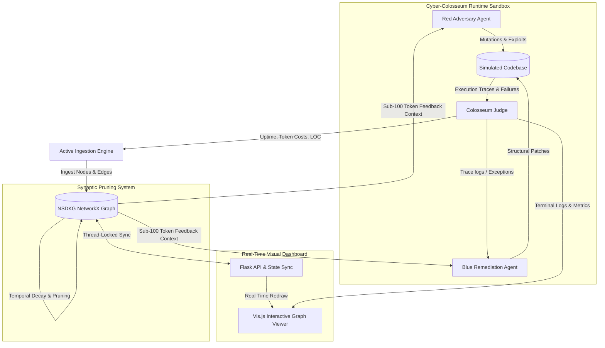
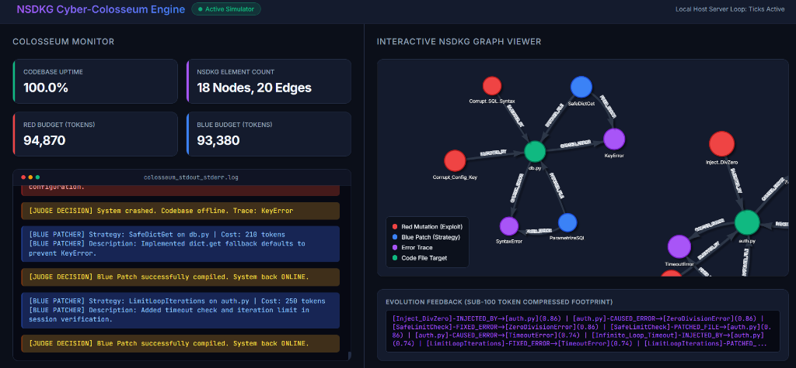

# NSDKG Evolution Engine

An autonomous process designer that utilizes a biologically-inspired synaptic decay graph to maintain a hyper-efficient, sub-100 token memory footprint for code optimization.

Now features the **Cyber-Colosseum Simulator**, an adversarial runtime environment where Red and Blue agents continuously mutate, exploit, patch, and optimize codebase security.

---

## 🏗️ System Architecture

Our hybrid architecture pairs a Track 4 Genetic Algorithm loop with a Track 1 Neuro-Synaptic Decaying Knowledge Graph (NSDKG) to eliminate LLM amnesia during iterative code mutation loops.



---

## ⚔️ The Cyber-Colosseum (Adversarial Sandbox)

The simulator is composed of the following core components:

1. **The Colosseum Sandbox (Component C)**: Manages a simulated codebase environment and runs evaluation suites. Red agents inject errors (e.g. division by zero, corrupted SQL parameters, timeout loops), and Blue agents generate structural fixes dynamically.
2. **Active Graph Ingestion Engine (Component D)**: Translates standard output, error messages, and stack trace logs into relational nodes (`Agent Actions`, `Code Files`, `Error Types`, `Patch Strategies`) and causal edges (`INJECTED_BY`, `CAUSED_ERROR`, `FIXED_BY`) in NetworkX.
3. **Synaptic Decay & Pruning (Component E)**: Runs a decay cycle on every tick using:
   $$W_{\text{new}} = W_{\text{old}} \times e^{-\lambda t}$$
   If a patch fails or an exploit is immediately neutralized, the associated nodes and edges are aggressively pruned from memory to keep the context size optimized.
4. **Sub-100 Token History**: Serializes the top-performing paths into a dense semantic feedback string under 100 tokens, which is then fed back to the agents for the next loop.

---

## 📺 Real-Time Visual Dashboard

The dashboard provides a premium dark-mode dashboard for monitoring the Colosseum:
- **Column 1 (Colosseum Monitor)**: Live metrics (Uptime %, remaining token budgets, element counts) and a scrolling color-coded CLI terminal (soft red for Red attacks, soft blue for Blue patches, yellow for Judge assessments).
- **Column 2 (Interactive NSDKG Graph Viewer)**: A physics-enabled, real-time visualization of the NetworkX graph using Vis.js. Nodes scale in size and edges in thickness according to their current synaptic decay weights.
- **Thread-Lock Safety**: All graph updates in the background simulation thread and reads in the Flask routing thread are synchronized with `threading.Lock` to guarantee runtime stability.



---

## 📦 Installation & Setup

1. **Clone the Repository**:
   ```bash
   git clone https://github.com/foxprint666/nsdkg-evolution-engine.git
   cd nsdkg-evolution-engine
   ```

2. **Install Dependencies**:
   ```bash
   pip install -r requirements.txt
   ```

3. **Configure Keys (Optional)**:
   Create a `.env` file from the template or set environment variables:
   ```bash
   QWEN_API_KEY="your-qwen-cloud-api-key"
   ```
   *If no key is configured, the engine automatically runs in a local mock scenario mode.*

4. **Launch the Engine & Dashboard**:
   ```bash
   python app.py
   ```
   The Flask server will start, launch the background Colosseum loop, and automatically open `http://127.0.0.1:5000` in your web browser.

---

## 💻 Sample Local Execution Output

When running `python main.py`, the core evolutionary agent executes:

```text
C:\Users\ASHLEY ALLEN\OneDrive\agent-qwen>py main.py
=========================================================
      NSDKG Evolution Engine - Initialization Sequence   
=========================================================
[NSDKG] Graph Memory Initialized.
[COGNITIVE CORE] Initialized Qwen Evolution Agent (Model: qwen3.7-max)

[SYSTEM] Simulating historical failures to populate knowledge graph...
[NSDKG INGESTION] Ingested verified pathway: [Initial_Mutation] -> [While_Loop] -> [TimeoutError]
[NSDKG INGESTION] Ingested verified pathway: [Syntax_Fix_1] -> [Parsing_Logic] -> [SyntaxError]

==================== GA GENERATION 1 ====================
[NSDKG] Graph state serialized. Active Edges: 4, Approx Tokens: 38
[COGNITIVE CORE] Dispatching prompt to Qwen API...
[COGNITIVE CORE] Mutation received.
[SANDBOX] Initiating sandboxed execution for sandbox_target.py
[SANDBOX] OS detected as Windows. Bypassing 'bwrap' and 'resource' modules. Using standard subprocess timeout.
[SANDBOX] Execution completed with exit code 1
[SYSTEM] Task Failed. Encountered: SyntaxError
[NSDKG INGESTION] Ingested verified pathway: [Gen_1_Mutation] -> [__init__] -> [SyntaxError]

--- [NSDKG SYNAPTIC DECAY] Running Decay Cycle (lambda=0.5, t_delta=1.0) ---
--- [NSDKG SYNAPTIC DECAY] Cycle Complete. Active Nodes: 8 ---
```
